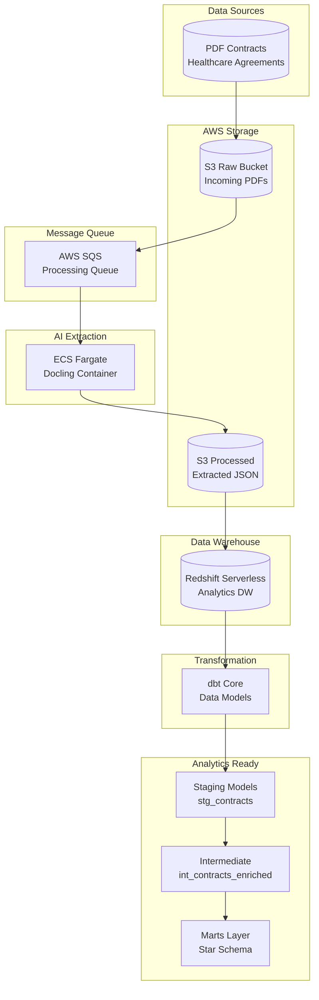
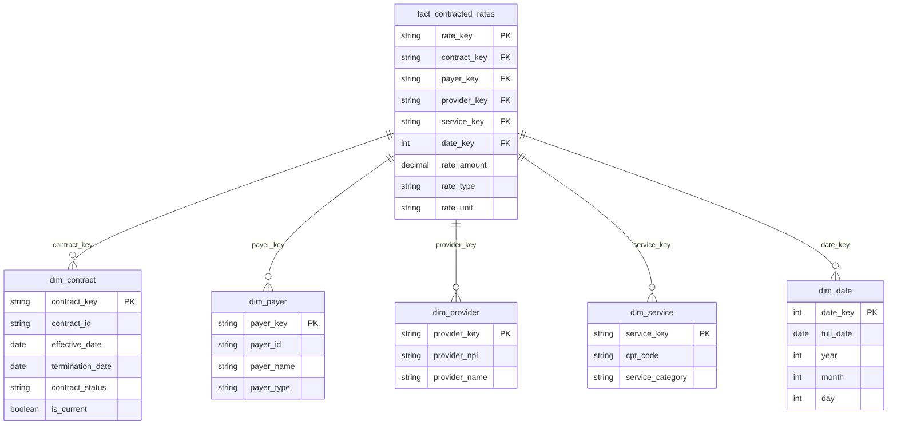

# AWS dbt Contract Parse Pipeline

An end-to-end data pipeline that extracts structured data from healthcare contract PDFs using AI (Docling), loads it into Redshift Serverless, and transforms it with dbt into an analytics-ready dimensional model.


---

## Architecture Overview



---

## Project Structure

```
aws-dbt-contract-parse/
├── extraction/                 # Docling PDF extraction service
│   ├── Dockerfile
│   ├── requirements.txt
│   └── src/
│       ├── extractor.py
│       ├── docling_parser.py
│       ├── contract_schema.py
│       └── s3_handler.py
├── dbt_project/               # dbt transformation models
│   ├── dbt_project.yml
│   ├── models/
│   │   ├── staging/           # stg_contracts, stg_rate_schedules
│   │   ├── intermediate/      # int_contracts_enriched
│   │   └── marts/core/        # dim_*, fact_contracted_rates
│   ├── seeds/                 # Reference data
│   ├── snapshots/             # SCD Type 2 tracking
│   └── tests/                 # Data quality tests
├── scripts/
│   ├── create_infra/          # AWS infrastructure scripts (01-10)
│   └── teardown/              # Cleanup scripts (01-11)
├── infrastructure/            # Terraform configs (alternative)
│   ├── main.tf
│   └── variables.tf
├── .github/workflows/         # CI/CD pipelines
└── docker-compose.yml         # Local development
```

---

## Key Features

| Feature | Implementation | Details |
|---------|---------------|---------|
| **PDF Extraction** | Docling + ECS Fargate | AI-powered contract parsing |
| **Storage** | AWS S3 | Raw PDFs and processed JSON |
| **Queue** | AWS SQS | Decoupled event-driven processing |
| **Data Warehouse** | Redshift Serverless | Pay-per-query analytics |
| **Transformation** | dbt Core | Tested, documented models |
| **Data Model** | Star Schema | Optimized for analytics |
| **IaC** | Bash Scripts / Terraform | Reproducible infrastructure |

---

## Data Model



### Model Layers

| Layer | Models | Description |
|-------|--------|-------------|
| **Staging** | `stg_contracts`, `stg_rate_schedules`, `stg_amendments` | Cleaned, typed source data |
| **Intermediate** | `int_contracts_enriched` | Business logic, aggregations |
| **Marts** | `dim_*`, `fact_contracted_rates` | Analytics-ready star schema |

---

## Deployment Guide

### Prerequisites

- AWS Account with appropriate permissions
- AWS CLI installed and configured
- Docker Desktop for Windows
- Python 3.10+
- Git for Windows

---

### Phase 1: AWS Infrastructure Setup

All infrastructure scripts are in `scripts/create_infra/`. Run these in **AWS CloudShell** (accessed via AWS Console).

#### Step 1.1: Open CloudShell and Set Region

1. Log into AWS Console
2. Click the CloudShell icon (terminal icon) in the top navigation bar
3. Set your region:

```bash
export AWS_DEFAULT_REGION=us-east-2
```

#### Step 1.2: Clone the Repository

```bash
cd ~
git clone https://github.com/bgall1976/aws-dbt-contract-parse.git
cd aws-dbt-contract-parse/scripts/create_infra
chmod +x *.sh
```

#### Step 1.3: Set Required Environment Variables

```bash
export REDSHIFT_ADMIN_PASSWORD='YourSecurePassword123!'
```

Password requirements:
- At least 8 characters
- At least one uppercase letter
- At least one lowercase letter  
- At least one number

#### Step 1.4: Run Infrastructure Scripts

Run each script in order:

```bash
bash 01-create-s3-buckets.sh
bash 02-create-sqs-queue.sh
bash 03-configure-s3-events.sh
bash 04-create-ecr-repo.sh
bash 05-create-iam-roles.sh
bash 06-create-cloudwatch-logs.sh
bash 07-create-ecs-cluster.sh
bash 08-create-ecs-task-definition.sh
bash 09-create-redshift.sh
bash 10-summary.sh
```

**Note:** Script 09 (Redshift) takes 5-10 minutes to complete.

#### Step 1.5: Save Your Connection Info

After running `10-summary.sh`, note these values (you'll need them later):

```
REDSHIFT_HOST=contract-pipeline-workgroup-dev.<account-id>.us-east-2.redshift-serverless.amazonaws.com
REDSHIFT_PORT=5439
REDSHIFT_DATABASE=contracts_dw
REDSHIFT_USER=admin
S3_RAW_BUCKET=contract-pipeline-raw-dev-<account-id>
S3_PROCESSED_BUCKET=contract-pipeline-processed-dev-<account-id>
```

---

### Phase 2: Build and Deploy Extraction Service

Run these in **Windows Command Prompt** with Docker Desktop running.

#### Step 2.1: Configure AWS CLI

Open Command Prompt and run:

```cmd
aws configure
```

Enter:
- AWS Access Key ID: (your key)
- AWS Secret Access Key: (your secret)
- Default region: us-east-2
- Output format: json

#### Step 2.2: Login to ECR

Replace `<account-id>` with your AWS account ID:

```cmd
aws ecr get-login-password --region us-east-2 | docker login --username AWS --password-stdin <account-id>.dkr.ecr.us-east-2.amazonaws.com
```

#### Step 2.3: Build Docker Image

```cmd
cd C:\path\to\aws-dbt-contract-parse\extraction
docker build -t contract-extractor .
```

#### Step 2.4: Tag and Push to ECR

Replace `<account-id>` with your AWS account ID:

```cmd
docker tag contract-extractor:latest <account-id>.dkr.ecr.us-east-2.amazonaws.com/contract-pipeline-dev:latest
docker push <account-id>.dkr.ecr.us-east-2.amazonaws.com/contract-pipeline-dev:latest
```

#### Step 2.5: Create ECS Service

Go back to **AWS CloudShell** and run:

```bash
DEFAULT_VPC_ID=$(aws ec2 describe-vpcs --filters "Name=isDefault,Values=true" --query 'Vpcs[0].VpcId' --output text)
SUBNET_ID=$(aws ec2 describe-subnets --filters "Name=vpc-id,Values=$DEFAULT_VPC_ID" --query 'Subnets[0].SubnetId' --output text)
SG_ID=$(aws ec2 describe-security-groups --filters "Name=group-name,Values=contract-pipeline-redshift-sg" --query 'SecurityGroups[0].GroupId' --output text)

aws ecs create-service \
    --cluster contract-pipeline-dev \
    --service-name contract-extractor \
    --task-definition contract-pipeline-task \
    --desired-count 1 \
    --launch-type FARGATE \
    --network-configuration "awsvpcConfiguration={subnets=[$SUBNET_ID],securityGroups=[$SG_ID],assignPublicIp=ENABLED}"
```

---

### Phase 3: Setup dbt

Run these in **Windows Command Prompt**.

#### Step 3.1: Create Virtual Environment

```cmd
cd C:\path\to\aws-dbt-contract-parse
python -m venv venv
venv\Scripts\activate
```

#### Step 3.2: Install Dependencies

```cmd
pip install -r requirements.txt
pip install dbt-redshift
```

#### Step 3.3: Configure dbt Profile

Open `C:\Users\<YourUsername>\.dbt\profiles.yml` in a text editor and add:

```yaml
contract_pipeline:
  target: dev
  outputs:
    dev:
      type: redshift
      host: "{{ env_var('REDSHIFT_HOST') }}"
      port: "{{ env_var('REDSHIFT_PORT') | int }}"
      user: "{{ env_var('REDSHIFT_USER') }}"
      password: "{{ env_var('REDSHIFT_PASSWORD') }}"
      dbname: "{{ env_var('REDSHIFT_DATABASE') }}"
      schema: public
      threads: 4
```

#### Step 3.4: Set Environment Variables

Replace `<account-id>` with your AWS account ID:

```cmd
set REDSHIFT_HOST=contract-pipeline-workgroup-dev.<account-id>.us-east-2.redshift-serverless.amazonaws.com
set REDSHIFT_PORT=5439
set REDSHIFT_USER=admin
set REDSHIFT_PASSWORD=YourSecurePassword123!
set REDSHIFT_DATABASE=contracts_dw
```

#### Step 3.5: Test Connection and Run dbt

```cmd
cd dbt_project

dbt debug
dbt deps
dbt seed
dbt run
dbt test
```

---

### Phase 4: Test the Pipeline

#### Step 4.1: Upload a Test PDF

In **AWS CloudShell**, replace `<account-id>` with your AWS account ID:

```bash
aws s3 cp sample-contract.pdf s3://contract-pipeline-raw-dev-<account-id>/incoming/
```

#### Step 4.2: Monitor Processing

```bash
aws logs tail /ecs/contract-pipeline-dev --follow
```

#### Step 4.3: Verify Data in Redshift

Connect to Redshift using a SQL client and run:

```sql
SELECT * FROM public.contracts LIMIT 10;
SELECT * FROM public_marts.fact_contracted_rates LIMIT 10;
```

---

## Cost Estimates

| Service | Estimated Monthly Cost |
|---------|------------------------|
| Redshift Serverless | $0 (idle) - $50+ (active) |
| S3 | < $1 |
| SQS | < $1 |
| ECS Fargate | $0 (stopped) - $30+ (running) |
| ECR | < $1 |
| **Total (idle)** | **< $5/month** |

**Note:** Redshift Serverless only charges when queries are running. ECS only charges when tasks are running.

---

## Tear Down Infrastructure

To delete all AWS resources and avoid charges, run in **AWS CloudShell**:

```bash
cd ~/aws-dbt-contract-parse/scripts/teardown
chmod +x *.sh

bash 01-delete-ecs-services.sh
bash 02-delete-ecs-task-definitions.sh
bash 03-delete-ecs-cluster.sh
bash 04-delete-redshift.sh
bash 05-delete-ecr-repo.sh
bash 06-delete-s3-buckets.sh
bash 07-delete-sqs-queues.sh
bash 08-delete-iam-roles.sh
bash 09-delete-cloudwatch-logs.sh
bash 10-delete-security-groups.sh
bash 11-summary.sh
```

---

## Troubleshooting

### dbt connection fails
- Verify environment variables are set: `echo %REDSHIFT_HOST%`
- Check Redshift workgroup status in AWS Console
- Verify security group allows inbound on port 5439

### ECS task fails to start
- Check CloudWatch logs: `/ecs/contract-pipeline-dev`
- Verify ECR image was pushed successfully
- Check IAM role permissions

### PDF not processing
- Verify S3 event notification is configured
- Check SQS queue for messages
- Check ECS service desired count > 0

### Docker build fails on Windows
- Ensure Docker Desktop is running
- Try restarting Docker Desktop
- Check that WSL 2 is properly configured

---

## License

MIT License - see [LICENSE](LICENSE) for details.
